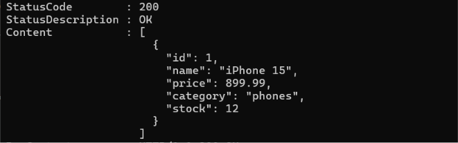

# Inventory API

REST API для управления товарами и заказами.

## Стек

- Go 1.26
- PostgreSQL
- pgx
- Docker
- Docker Compose

---

## Возможности

### Products

- Получить товар по ID
- Создать товар
- Обновить товар
- Удалить товар
- Получить список товаров
- Поиск товаров
- Статистика товаров
- Дорогие товары
- Дешёвые товары
- Статистика по категориям

### Orders

- Получить список заказов
- Заказы пользователя
- Заказы по товару
- Оплаченные заказы
- Статистика заказов

---

## Структура проекта

```
Inventory-API/
│
├── cmd/
├── internal/
│   ├── database/
│   ├── handlers/
│   ├── models/
│   └── repository/
│
├── Dockerfile
├── docker-compose.yml
├── go.mod
└── README.md
```

---

## Запуск

```bash
docker compose up --build
```

Сервер будет доступен по адресу

```
http://localhost:9090
```

---

## API

### Products

| Method | Endpoint |
|---------|----------|
| GET | /products |
| GET | /product?id=1 |
| POST | /product |
| PUT | /product?id=1 |
| DELETE | /product?id=1 |
| GET | /products/search |
| GET | /products/category |
| GET | /products/stats |
| GET | /products/expensive |
| GET | /products/cheap |
| GET | /products/category/stats |

### Orders

| Method | Endpoint |
|---------|----------|
| GET | /orders |
| GET | /orders/users |
| GET | /orders/user |
| GET | /orders/product |
| GET | /orders/product/id |
| GET | /orders/paid |
| GET | /orders/stats |

---

### Get product

```bash
curl "http://localhost:9090/product?id=1"
```



## Используемые технологии

- Go
- PostgreSQL
- pgx
- Docker
- HTTP REST API

---

## Статус проекта

🚧 В разработке.

Следующие этапы:

- JWT Authentication
- Redis
- Unit Tests
- Graceful Shutdown
- Swagger
